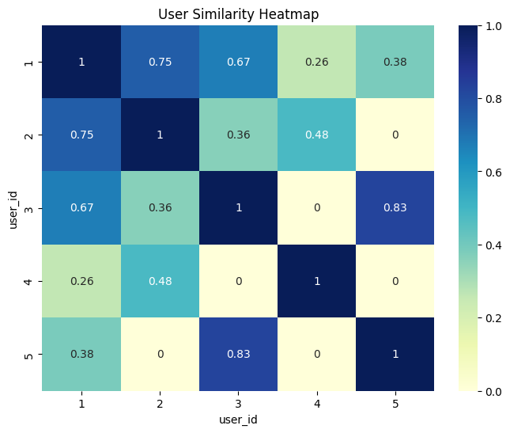

# CODTECH IT SOLUTIONS MACHINE LEARNING INTERNSHIP

## TASK 4: RECOMMENDATION SYSTEM

### Project Overview
This project involves building a **Recommendation System** using **Collaborative Filtering** to suggest movies to users based on the preferences of similar users.

### Task Details
* **Organization**: CODTECH IT SOLUTIONS
* **Intern Name**: Purvi Ganvir
* **Intern ID**: CTIS6235
* **Domain**: Machine Learning
* **Duration**: 17th Feb to 17th March
* **Mentor**: Muzzamail

### Technical Roadmap
1.  **Data Structuring**: Created a User-Item matrix from a movie rating dataset.
2.  **Similarity Computation**: Implemented **Cosine Similarity** to find users with correlated tastes.
3.  **Recommendation Logic**: Developed a function to predict ratings for unvisited items and suggest the highest-rated ones.
4.  **Evaluation**: Utilized **Root Mean Squared Error (RMSE)** to measure the accuracy of the recommendation engine.

---

### Similarity Analysis
Below is the User Similarity Heatmap used to identify clusters of users with similar tastes:

---

### Tools & Technologies Used
* **Python**: Core programming language.
* **Pandas/NumPy**: For matrix manipulation.
* **Scikit-Learn**: For similarity calculations and evaluation metrics.
* **Seaborn**: For visualizing user correlations.
